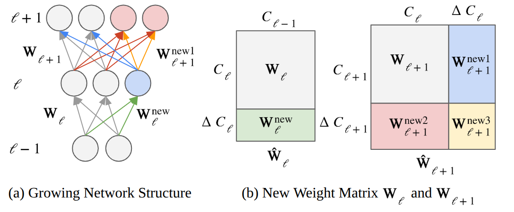
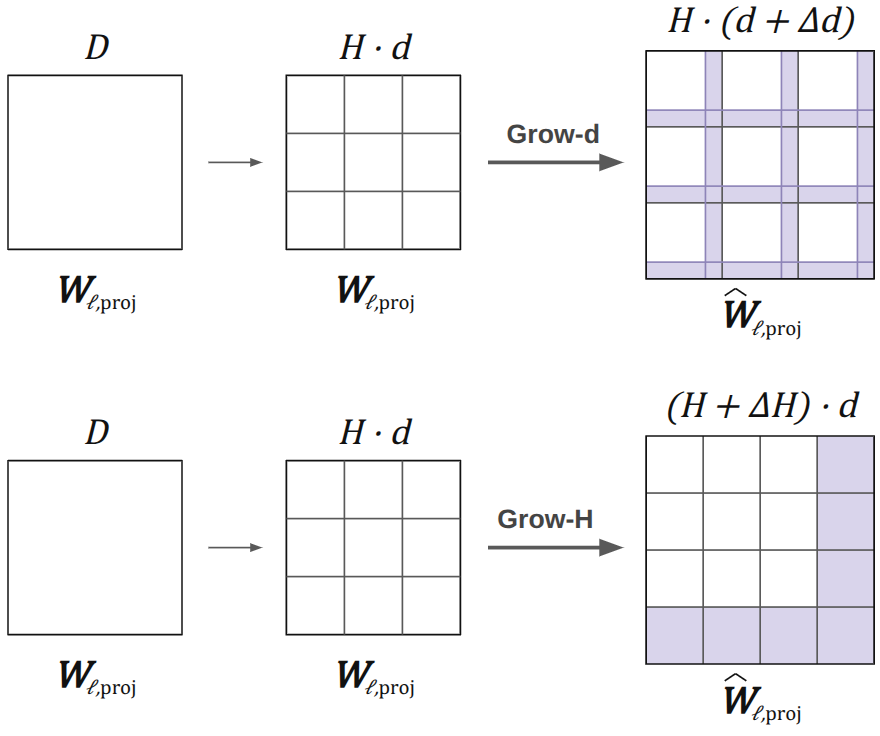

# Neural Network Growing: On the Impact of Different Initialization Modes

Code accompanying the manuscript **“Neural Network Growing: On the Impact of
Different Initialization Modes.”**

Y. Wang<sup>1</sup>, J. Mille<sup>1,2</sup>, M. Hidane<sup>1</sup>,
S. Rivaud<sup>2</sup>, T. Rudkiewicz<sup>2</sup>

<sup>1</sup> INSA Centre Val de Loire, Université de Tours, LIFAT, France  
<sup>2</sup> Université Paris-Saclay, CNRS, LISN, France

This repository studies scheduled neural-network growth from a small seed model
to a predefined target architecture. It focuses on how newly introduced weights
and optimizer states are initialized when dense, convolutional, and attention
layers are widened during training.

## Overview

Large networks are expensive throughout training even though their full capacity
may not be needed at the beginning. Our experiments start from a network whose
growable widths are one quarter of the target widths, train the seed model, and
then expand it according to a fixed schedule. A fixed target-size model trained
from scratch is used as the **Big Net** baseline.

The study addresses three implementation questions:

1. How should the added blocks be initialized when consecutive layers grow?
2. How does ViT growth differ when increasing per-head dimension versus head count?
3. How should accumulated optimizer state be handled after parameter tensors grow?

The release covers MLP, VGG-11, WRN-28-1, ViT, and CvT-13 on MNIST and CIFAR.
It includes Modes A–E and, where applicable, the GradMax baseline.

## Block-wise initialization

When two consecutive layers grow, the following weight matrix gains both rows
and columns:

$$
\widehat{\mathbf W}_{\ell+1} =
\begin{bmatrix}
\mathbf W_{\ell+1} & \mathbf W^{\mathrm{new1}}_{\ell+1} \\
\mathbf W^{\mathrm{new2}}_{\ell+1} & \mathbf W^{\mathrm{new3}}_{\ell+1}
\end{bmatrix}.
$$

The three added blocks respectively connect new-to-existing, existing-to-new,
and new-to-new units. The same inherited/added partition is used for dense
matrices, convolution kernels, and head-wise attention projections.

<p align="center">
  
</p>

| Mode | Added-block rule | Function preserving |
|---|---|---|
| A — Column-Zero Initialization | zero `new1`; sample `new2` and `new3` with the grown fan-in | Yes |
| B — Row-First Column-Zero Initialization | sample `new2` with the inherited fan-in; zero `new1` and `new3` | Yes |
| C — Row-Zero Initialization | sample `new1`; zero `new2` and `new3` | Yes |
| D — Homogeneous Initialization | initialize all added blocks with the default grown-layer rule | No |
| E — Homogeneous Initialization with Empirical Variance | sample all added blocks using the inherited weight variance | No |

For ReLU networks, Mode C uses the convention $\phi'(0)=1$ so that zero-valued
added coordinates can still receive gradients. Existing biases are copied and
new biases are initialized to zero in every mode.

## Optimizer state after growth

Tensor-shaped optimizer state follows the same coordinate layout as its
parameter. If $\mathbf S_{\ell,t}$ is an SGD momentum buffer or an AdamW moment,
the default **Keep State** rule is

$$
\widehat{\mathbf S}_{\ell,t} =
\begin{bmatrix}
\mathbf S_{\ell,t} & \mathbf 0 \\
\mathbf 0 & \mathbf 0
\end{bmatrix}.
$$

Thus inherited weights retain their optimization history while newly added
coordinates start with zero momentum and zero adaptive-scale history. Scalar
states, such as the AdamW step counter, are preserved in the main experiments.

## Experimental protocol

The main experiments use a common schedule:

- seed width: one quarter of every growable target width;
- seed phase: 10,000 parameter-update steps;
- growth: 12 events separated by 2,500 steps;
- repetitions: three random seeds;
- comparison: Big Net, Modes A–E, and GradMax when supported.

| Backbone | Paper dataset | Target configuration | Optimizer | Epochs |
|---|---|---|---|---:|
| MLP | MNIST | hidden widths 512–256 | SGD, momentum 0.9, LR 0.05 | 200 |
| VGG-11 | CIFAR-10/100 | canonical VGG-11 widths, stride downsampling | SGD, momentum 0.9, LR 0.05 | 200 |
| WRN-28-1 | CIFAR-10/100 | grow internal residual-block convolutions | SGD, momentum 0.9, LR 0.01 | 200 |
| ViT | CIFAR-10 | $D=256$, depth 8, $H=4$, patch size 2 | AdamW, LR 0.001 | 200 |
| CvT-13 | CIFAR-10 | stage widths 64–192–384 | AdamW, scaled LR 0.0000625 | 100 |

ViT uses 10 warmup epochs, label smoothing, global gradient clipping, AMP, and
CutMix. CvT-13 uses 20 warmup epochs, label smoothing, gradient clipping, and
Mixup/CutMix-style augmentation. GradMax is run for MLP, VGG-11, and WRN-28-1;
it is not part of the ViT or CvT-13 comparison.

The runner also accepts CIFAR-100 for ViT and CvT as an additional code path,
but those combinations are not reported in the current manuscript.

## Installation

Python 3.10 or newer is recommended. The release was verified with Python
3.10.12, PyTorch 2.1.2, torchvision 0.16.2, NumPy 1.26.3, and Matplotlib 3.8.0.

From the cloned repository root:

```bash
python3 -m venv .venv
source .venv/bin/activate
python3 -m pip install --upgrade pip
python3 -m pip install -r requirements.txt
python3 -m nngrow --list-tasks
```

CUDA is strongly recommended for the full ViT and CvT experiments. CPU execution
is supported for configuration inspection and structural verification.

## Data

Public datasets are not stored in the repository. By default they are cached in
the project-level `data/` directory. Torchvision performs the official download,
archive extraction, and checksum verification; existing files are reused.

- [MNIST dataset interface](https://docs.pytorch.org/vision/stable/generated/torchvision.datasets.MNIST.html)
- [CIFAR-10 and CIFAR-100](https://www.cs.toronto.edu/~kriz/cifar.html)

Use `--data-root PATH` to select a shared cache, or `--no-download` to require an
already prepared local copy.

## Running the experiments

All tasks are exposed through one dispatcher:

```bash
python3 -m nngrow --list-tasks
```

### Main comparison

List valid model/dataset pairs and inspect a resolved configuration:

```bash
python3 -m nngrow main --list
python3 -m nngrow main \
  --model vgg --dataset cifar100 --show-config
```

Run a paper experiment:

```bash
python3 -m nngrow main --model mlp --dataset mnist
python3 -m nngrow main --model vgg --dataset cifar10
python3 -m nngrow main --model wrn --dataset cifar100
python3 -m nngrow main --model vit --dataset cifar10
python3 -m nngrow main --model cvt --dataset cifar10
```

Select one or more training branches by key. `big_net` controls the Big Net
baseline independently of the growing modes.

```bash
# Big Net only
python3 -m nngrow main --model vgg --dataset cifar10 \
  --modes big_net

# One growing branch, without Big Net
python3 -m nngrow main --model vgg --dataset cifar10 \
  --modes mode_b

# Any explicit combination
python3 -m nngrow main --model vgg --dataset cifar10 \
  --modes big_net mode_a mode_c mode_d

# All Modes A-E, without Big Net or GradMax
python3 -m nngrow main --model vgg --dataset cifar10 \
  --modes all_modes_NoGradMax

# Big Net, all Modes A-E, and GradMax
python3 -m nngrow main --model vgg --dataset cifar10 \
  --modes big_net all_modes_WithGradMax
```

Valid explicit names are `big_net`, `mode_a`, `mode_b`, `mode_c`, `mode_d`,
`mode_e`, and `gradmax` where supported. Each `all_modes_*` alias may be used
alone or combined only with `big_net`. Omitting `--modes` retains the previous
behavior and runs Big Net plus every mode supported by the selected model. ViT
and CvT do not support GradMax, so `all_modes_WithGradMax` is rejected for those
models.

A run without `big_net` does not produce a baseline curve; consequently,
Big-Net-relative metrics such as `TimeToTarget` must be computed from a run that
also selected `big_net`.

Common overrides include `--seed`, `--num-runs`, `--epochs`, `--batch-size`,
`--lr`, `--device`, `--modes`, `--grow-start`, `--grow-every`, and
`--grow-steps`. Repeating `--seed` supplies an explicit seed list.

### Changing the number of growth events

`--grow-steps` controls how many events transform the seed network into the
target network. For example:

```bash
python3 -m nngrow main --model vgg --dataset cifar10 \
  --modes mode_a mode_b --grow-steps 6
```

The total width difference is distributed as evenly as possible across the
requested events. The runner validates the resulting integer widths before
loading data and rejects empty or structurally invalid growth events. It also
checks that `--epochs`, `--grow-start`, and `--grow-every` provide enough
optimization steps to execute the complete schedule.

For the default one-quarter-width seed and full-width target, the accepted
counts are:

| Model or task | Valid `grow_steps` | Reason |
|---|---:|---|
| MLP | 1–192 | every event must add at least one unit to each hidden layer |
| VGG-11, without GradMax | 1–48 | every event must add at least one channel to each growable convolution |
| VGG-11, with GradMax | 5–48 | the lower bound prevents an SVD-rank-limited GradMax update from being truncated |
| WRN-28-1 | 1–12 | every event must add at least one internal channel to every residual block |
| ViT | 1–48 | every event adds at least one dimension to each of the four heads |
| CvT-13 | 1–48 | every growable stage adds at least one dimension per head |
| ViT Grow-d/Grow-H ablation | 1, 2, 3, 4, 6, or 12 | Grow-H must add a whole number of heads at every event |

These ranges are recomputed from the actual rounded widths when the
`seed_width` or `big_width` configuration field is changed programmatically.
VGG and WRN perform an additional GradMax SVD-rank check whenever `gradmax` is
selected. MLP GradMax can reuse available singular directions and therefore has
no additional lower bound. A Big-Net-only run does not perform growth, so only
the general positive-integer check applies.

### Appendix A: Grow-d versus Grow-H

ViT has hidden dimension $D=H d$. The main experiment fixes the number of heads
$H$ and grows the per-head dimension $d$. Appendix A compares this with fixing
$d$ and growing $H$.

<p align="center">
  
</p>

Both paths start from $D=64$ and finish at $D=256$:

- **Grow-d:** $H=4$ remains fixed while $d$ grows from 16 to 64;
- **Grow-H:** $d=16$ remains fixed while $H$ grows from 4 to 16.

```bash
python3 -m nngrow vit-axis --show-config
python3 -m nngrow vit-axis --dataset cifar10
```

The release trains the four rows in the current manuscript: Grow-d (B/D) and
Grow-H (B/D).

### Appendix B: optimizer-state handling

The optimizer ablation uses a lightweight three-stage Conv–BatchNorm–ReLU–Pool
network on CIFAR-10. It grows once before epoch 25 from widths 8–16–32 to one of
32–64–128, 64–128–256, or 128–256–512. Training lasts 80 epochs with batch size
500 and LR $5\times10^{-4}$.

Inspect the complete experiment matrix or run one selected case:

```bash
python3 -m nngrow optimizer-state --show-plan
python3 -m nngrow optimizer-state \
  --optimizer adamw --initialization-mode b --target-width 64-128-256
```

The default reported strategies are:

- `keep_state`: preserve inherited state and zero added entries;
- `reset_state`: clear optimizer state while continuing the cosine schedule;
- `keep_moments_reset_step`: preserve AdamW moments but reset its step counter.

The optional **Rebuild Optimizer & Restart Scheduler** condition changes the
learning-rate schedule as well as optimizer state, so it is omitted from the
current manuscript table. It remains available as an explicitly labelled
diagnostic through `--include-scheduler-restart`. See
the mapping in [PAPER_MAPPING.md](PAPER_MAPPING.md).

## Outputs and reported metrics

Main-run outputs are written below
`outputs_compare/unified/<model>/<dataset>/`. Ablation outputs are written below
`outputs_compare/ablations/<task>/`. Each run records:

- the fully resolved configuration and seed;
- per-epoch train/test loss and accuracy;
- cumulative wall-clock time and parameter count;
- comparison plots and tabular result files using the manuscript labels.

Tabular outputs retain a stable machine-readable key alongside the corresponding
paper label, such as `mode_b` and `Mode B: Row-First Column-Zero
Initialization`.

The manuscript reports final test accuracy as mean and standard deviation over
three runs. Where stated, final accuracy is averaged over the last five epochs.
`TimeToTarget` uses the Big Net's last-five-epoch mean as its target and requires
three consecutive matching epochs. Wall-clock values depend on hardware and
should only be compared within the same backbone/hardware setting. The paper's
MLP/VGG/WRN runs used a Tesla P100-16GB; ViT/CvT used an NVIDIA A100-40GB.

## Repository structure

```text
unified_experiments/
├── nngrow/                         # executable Python package
│   ├── __main__.py, run.py         # task dispatcher
│   ├── main.py, experiment.py      # shared main-comparison runner
│   ├── datasets.py                 # dataset compatibility layer
│   ├── models/                     # architectures and growth operations
│   │   ├── mlp.py, vgg.py, wrn.py
│   │   ├── vit.py, cvt.py
│   │   └── _growth.py              # shared expansion utilities
│   └── ablations/
│       ├── vit_growth_axis/        # Appendix A
│       └── optimizer_state/        # Appendix B
├── tests/
│   └── verify.py                   # structural regression suite
├── assets/                         # figures used by this README
├── PAPER_MAPPING.md                # manuscript section/table to code map
└── requirements.txt
```

The files in `nngrow/models/` contain complete construction and growth logic; the
shared runner owns seeding, training, split timing, optimizer/scheduler
progression, evaluation, and result serialization. The package has no runtime
dependency on the development source tree. CvT-13 is consolidated into a single
model module.

## File guide

| File or directory | Responsibility |
|---|---|
| `README.md` | experiment overview, setup, commands, outputs, and citation |
| `PAPER_MAPPING.md` | correspondence between manuscript sections, tables, and commands |
| `nngrow/__main__.py` | package entry point for `python3 -m nngrow` |
| `nngrow/run.py` | dispatches the main comparison and the two ablation tasks |
| `nngrow/main.py` | parses command-line options for the main comparison |
| `nngrow/experiment.py` | shared configuration, training loop, growth schedule, evaluation, plots, and result serialization |
| `nngrow/datasets.py` | MNIST/CIFAR download checks and the reported preprocessing pipelines |
| `nngrow/models/mlp.py` | MLP architecture, Modes A–E, and GradMax growth |
| `nngrow/models/vgg.py` | VGG-11 architecture, convolutional Modes A–E, and GradMax growth |
| `nngrow/models/wrn.py` | WRN-28-1 architecture, internal-width Modes A–E, and GradMax growth |
| `nngrow/models/vit.py` | ViT architecture, head-wise Modes A–E, optimizer-state transfer, and augmentation |
| `nngrow/models/cvt.py` | consolidated CvT-13 architecture, stage-wise Modes A–E, and training utilities |
| `nngrow/models/_growth.py` | shared low-level parameter-expansion helpers for MLP, VGG, and WRN |
| `nngrow/ablations/vit_growth_axis/` | Appendix A entry point and Grow-d/Grow-H adapter |
| `nngrow/ablations/optimizer_state/` | Appendix B entry point, model, and experiment runner |
| `nngrow/ablations/**/__main__.py` | direct module launchers for the two ablations |
| `tests/verify.py` | dataset-free regression checks for models, modes, growth plans, and ablations |
| `requirements.txt` | tested Python dependencies |
| `assets/` | figures displayed in this README |
| `.gitignore` | excludes datasets, outputs, checkpoints, caches, and local artifacts |

The `__init__.py` files declare Python packages, while each ablation's
`__main__.py` forwards `python3 -m ...` execution to its `main.py` entry point.

For exact table/command correspondence and documented implementation decisions,
read [PAPER_MAPPING.md](PAPER_MAPPING.md).

## Verification

Run the fast regression suite after installation:

```bash
python3 -m tests.verify
```

This check requires no dataset. It verifies model construction, the added-block
layout of Modes A–E, final-width plans, CvT-13 parameter count, Grow-d/Grow-H
layouts, and optimizer-state migration. Passing this suite checks structural
correctness; it does not replace the complete 80/100/200-epoch runs.

## Citation

If you use this code, please cite the accompanying manuscript. Update the entry
with the final venue, year, and DOI when they become available.

```bibtex
@article{wang_neural_network_growing,
  title   = {Neural Network Growing: On the Impact of Different Initialization Modes},
  author  = {Wang, Y. and Mille, J. and Hidane, M. and Rivaud, S. and Rudkiewicz, T.},
  note    = {Preprint}
}
```

## Scope

This release studies **scheduled layerwise width growth**: the target size,
growth locations, and growth times are selected before training. Adaptive rules
for deciding when or where to grow are outside the scope of the manuscript.
